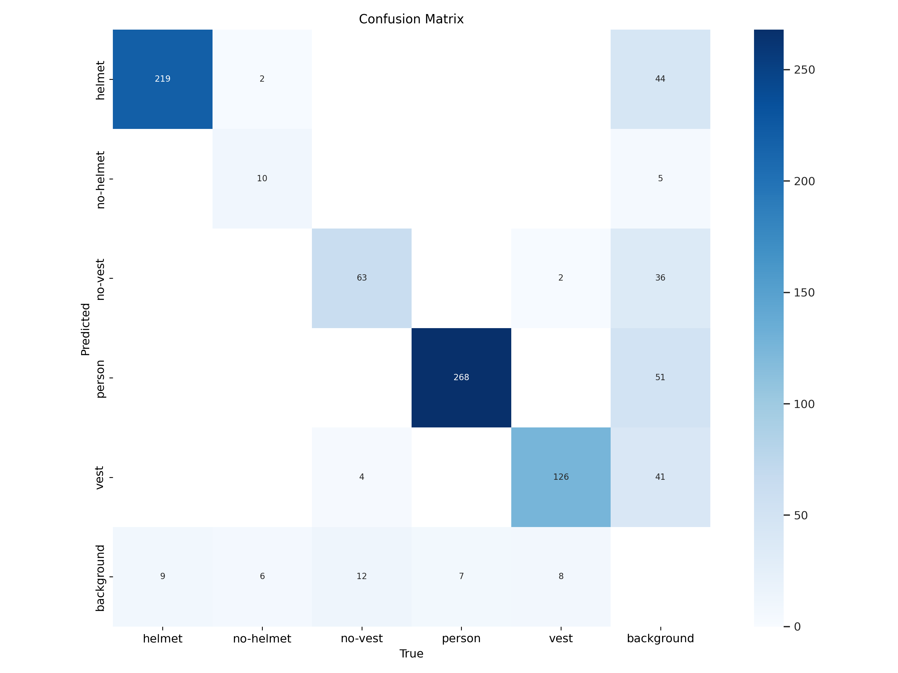
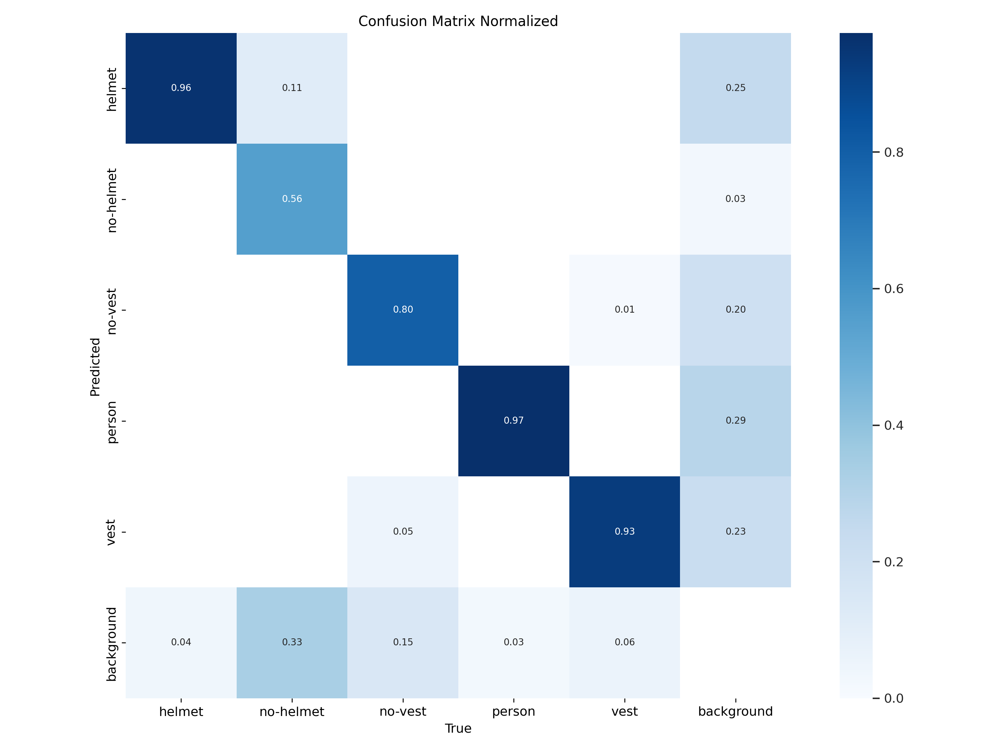
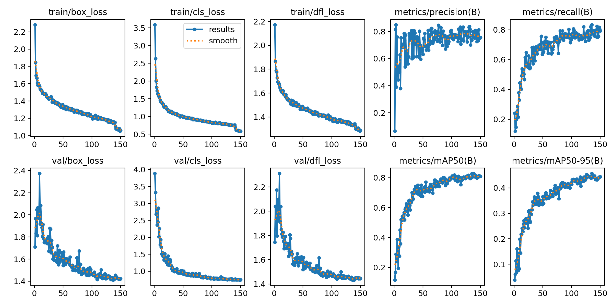
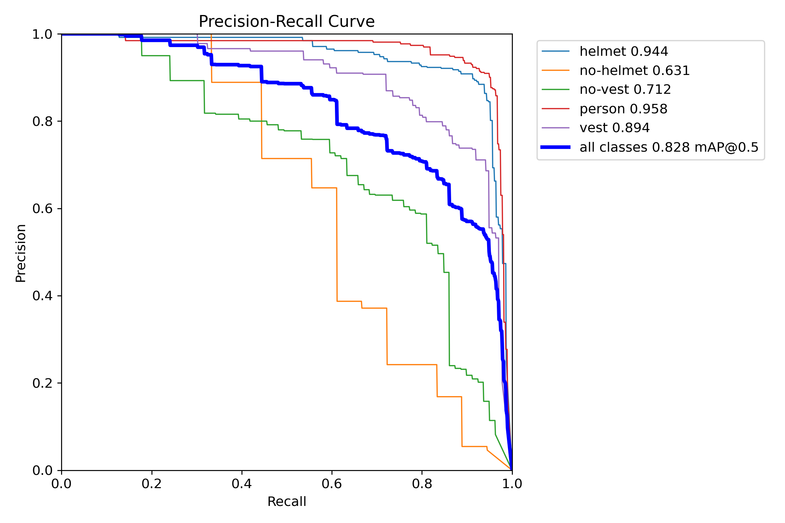

# Python YOLO V8

> My Study for data science and artificial intelligence

## Concepts

- Artificial Intelligence (AI)
- Python (3.12)
- YOLO V8
- Stratification Dataset
- Sklearn

## Train 1

### Commands

**Train:**
```bash
yolo mode=train task=detect model=yolov8n.pt data=$(pwd)/dataset/data.yaml epochs=150 cache=ram batch=-1 imgsz=640 degrees=+180
```

**Validate:**
```bash
yolo mode=val task=detect model=$(pwd)/runs/detect/train/weights/best.onnx data=$(pwd)/dataset/data.yaml
```

**Test:**
```bash
yolo mode=predict task=detect model=$(pwd)/runs/detect/train/weights/best.onnx source=$(pwd)/dataset/test/images conf=0.5 imgsz=650
```

### Results train

Confusion Matrix:


Confusion Matrix Normalized:


Results:


PR Curve:

