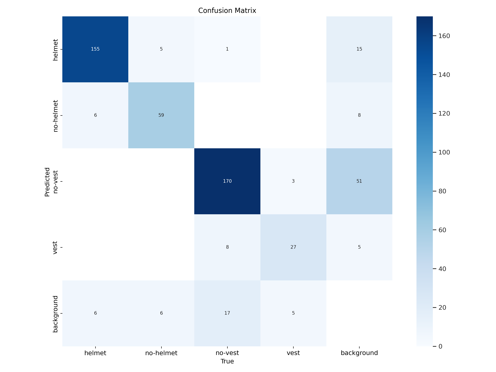
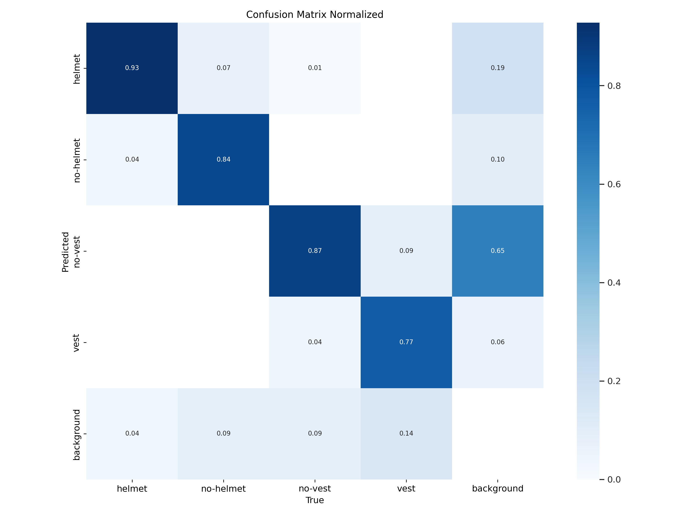
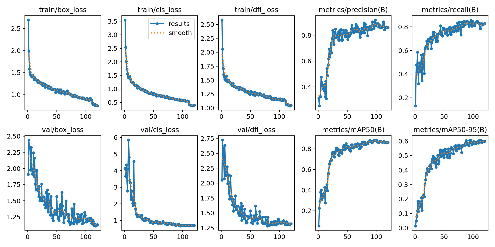
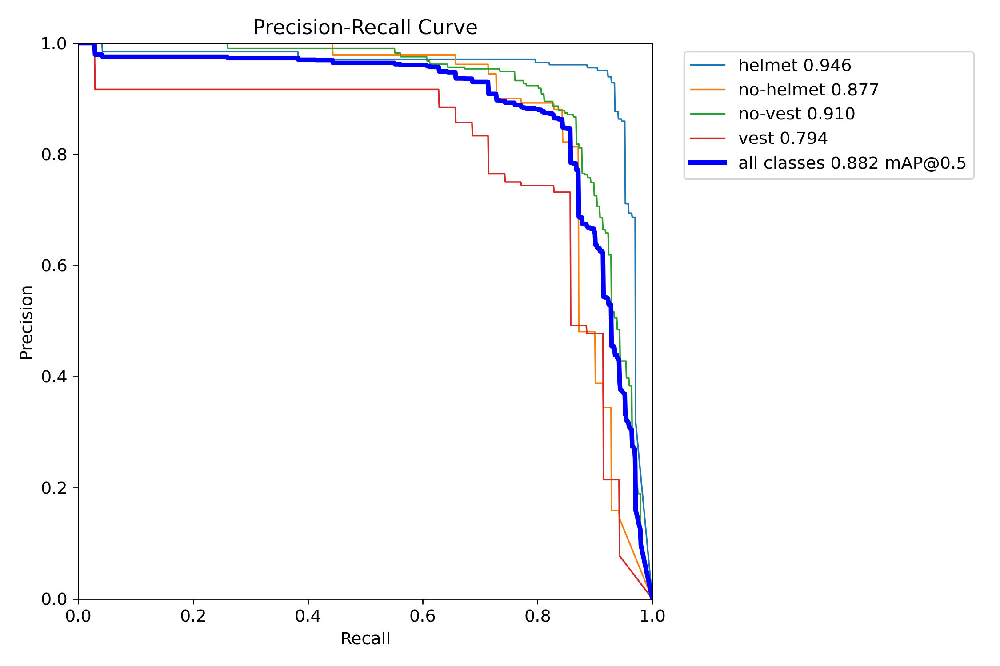
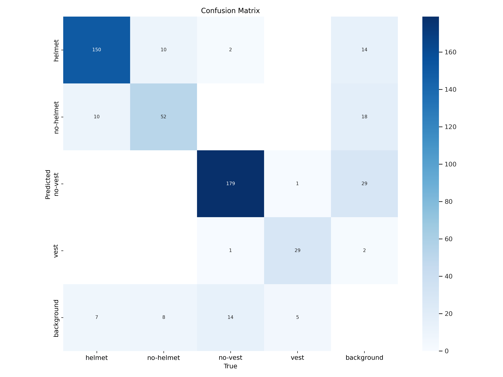
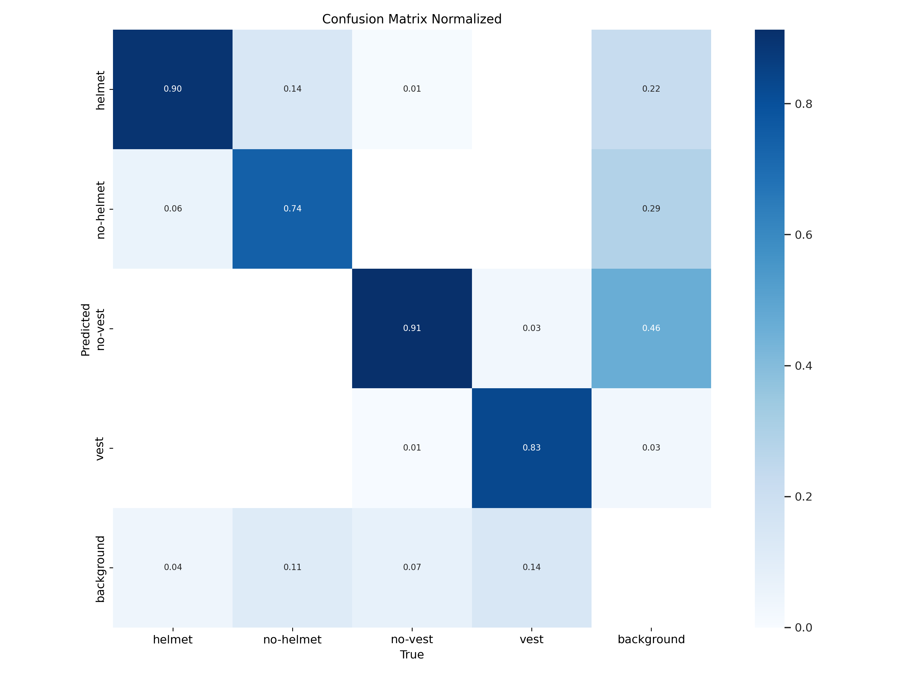
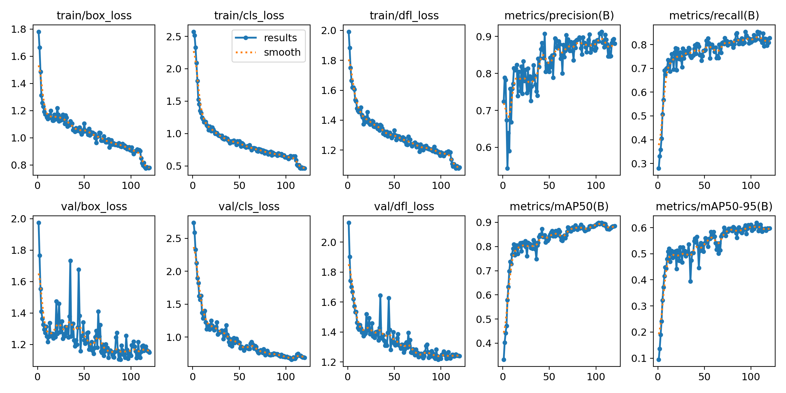

# Python YOLO V8

> My Study for data science and artificial intelligence

## Concepts

- Artificial Intelligence (AI)
- Python (3.12)
- YOLO V8
- Stratification Dataset
- Sklearn

### Stratification

- Train: 80% 
- Validate: 10%
- Test: 10%

## Train 1

Network: yolov8n.pt

### Commands

```bash
# Train
yolo mode=train task=detect model=yolov8n.pt data=$(pwd)/dataset/data.yaml epochs=150 cache=ram batch=-1 imgsz=640 degrees=+180
# Validate
yolo mode=val task=detect model=$(pwd)/runs/detect/train/weights/best.onnx data=$(pwd)/dataset/data.yaml
# Test
yolo mode=predict task=detect model=$(pwd)/runs/detect/train/weights/best.onnx source=$(pwd)/dataset/test/images conf=0.5 imgsz=650
```

### Results train


## Train 2

Network: yolov8s.pt

### Commands

```bash
# Train
yolo mode=train task=detect model=yolov8s.pt data=$(pwd)/dataset2/data.yaml epochs=120 cache=ram batch=-1 imgsz=640 degrees=+180
# Validate
yolo mode=val task=detect model=$(pwd)/runs2/detect/train/weights/best.onnx data=$(pwd)/dataset2/data.yaml
# Test
yolo mode=predict task=detect model=$(pwd)/runs2/detect/train/weights/best.onnx source=$(pwd)/dataset2/test/images conf=0.5 imgsz=650
```






## Train 3

Network: /runs/detect/train/weights/bets.pt

### Commands

```bash
# Train
yolo mode=train task=detect model=$(pwd)/runs/detect/train/weights/bets.pt data=$(pwd)/dataset2/data.yaml epochs=120 cache=ram batch=-1 imgsz=640 degrees=+180
# Validate
yolo mode=val task=detect model=$(pwd)/runs3/detect/train/weights/best.onnx data=$(pwd)/dataset2/data.yaml
# Test
yolo mode=predict task=detect model=$(pwd)/runs3/detect/train/weights/best.onnx source=$(pwd)/dataset2/test/images conf=0.5 imgsz=650
```






### Create by
© [Giovane Santos](https://giovanesantossilva.github.io/)